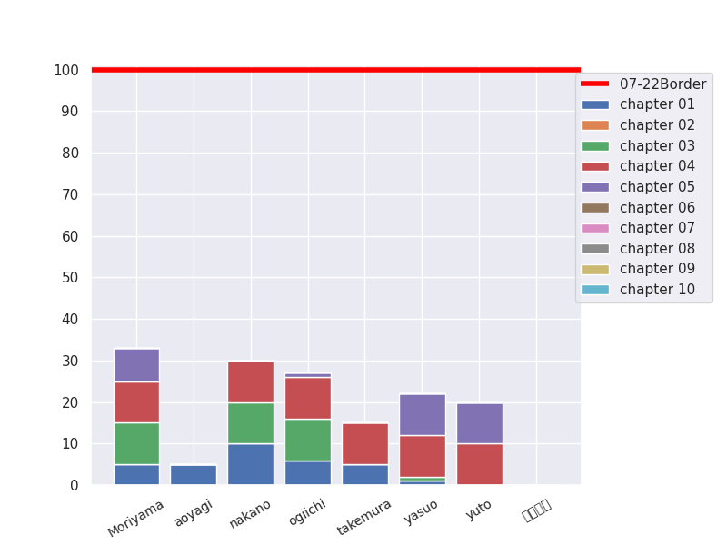

# 100knock2025 in 桂井研

桂井研2025年度新入生向け勉強会として、言語処理100本ノックに取り組みます。  
教材URL: https://nlp100.github.io/ja/

毎週1章分（10問）解いてください。   

## usage

初回はこのレポジトリを clone してください。

```
git clone https://github.com/potama2002/IML2025K.git
```

コードを書いたら remote repository に push してください。
チャプター名、ファイル名はすべて二桁の数字にしてください（例: `chapter01`, `knock00.py`）。
1章分の問題を1つのファイルにまとめている場合、`chapterXX_all.py`, `chapterXX_all.ipynb`というファイル名でchapterXXフォルダの直下においてください（XXは2桁の章番号）
```
git branch <任意のブランチ名(以下、b_name)> (e.g. git branch kamoto)
git checkout <b_name>
git add <任意のファイル・フォルダ> (e.g. git add ./kamoto/chapter01/knock01.py)
git commit -m "your message"
git pull origin main
git push origin <b_name>
```
## 注意事項
test
新入生はできるだけ Python3 系で書いてください。
わからないところは**積極的**に 研究室の人に聞いてください。
**他の人のディレクトリを変更することは絶対にやめてください。**
（他の人のコードを閲覧したい場合は、Web サイト上から閲覧してください。）
chapter##/knockXX.py のフォルダ名とファイル名を間違えると進捗グラフに反映されません。

## みんなの進捗



## このレポジトリは小町研から参照しております。
URL : https://github.com/tmu-nlp/100knock2022
